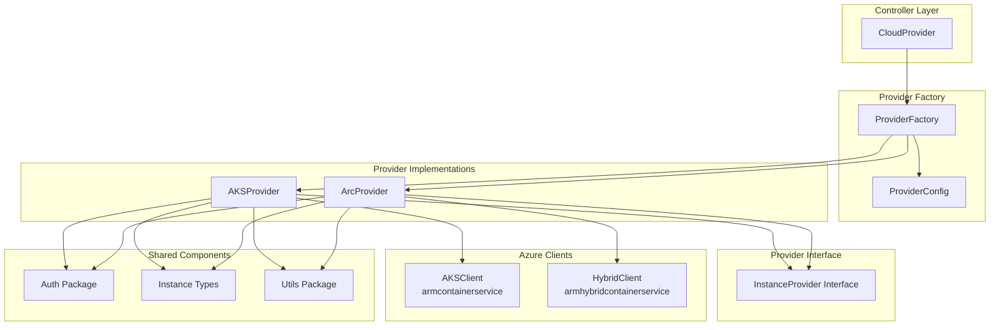

# Design Document: Arc AKS Provider Support for GPU Provisioner

## Executive Summary

This document outlines the design for adding Azure Arc-enabled Kubernetes (Arc AKS) provider support to the GPU Provisioner alongside the existing cloud AKS provider. The implementation will introduce a provider abstraction layer while maintaining backwards compatibility and reusing shared components like authentication and instance management.

## Table of Contents

1. [Current Architecture Analysis](#current-architecture-analysis)
2. [Requirements](#requirements)
3. [Proposed Architecture](#proposed-architecture)
4. [Implementation Plan](#implementation-plan)
5. [Component Changes](#component-changes)
6. [Configuration Changes](#configuration-changes)
7. [Migration Strategy](#migration-strategy)
8. [Testing Strategy](#testing-strategy)
9. [Risks and Mitigations](#risks-and-mitigations)

## Current Architecture Analysis

### Package Structure
```
pkg/
├── auth/                    # Azure authentication (shared)
├── cloudprovider/          # Karpenter CloudProvider interface
├── controllers/            # Kubernetes controllers
├── operator/              # Operator initialization
├── providers/
│   └── instance/          # Single AKS provider implementation
└── utils/                 # Utility functions
```

### Key Components

#### 1. Instance Provider (`pkg/providers/instance/`)
- **Provider Struct**: Core provider implementation with tightly coupled AZClient
- **AZClient**: Uses `armcontainerservice/v4` SDK exclusively
- **AgentPoolsAPI Interface**: Abstraction for agent pool operations
- **ARM Utils**: Agent pool CRUD operations

#### 2. Authentication (`pkg/auth/`)
- **Config**: Azure configuration management
- **ClientConfig**: Azure client configuration
- **Credential Management**: Federated identity and managed identity support

#### 3. Initialization Flow
```go
// cmd/controller/main.go
operator.NewOperator() 
  → GetAzConfig()
  → instance.CreateAzClient(config)
  → instance.NewProvider(azClient, ...)
  → cloudprovider.New(instanceProvider, ...)
```

### Current Limitations
1. **Hardcoded SDK**: Only supports `armcontainerservice/v4` for cloud AKS
2. **Single Provider Type**: No abstraction for multiple provider implementations
3. **Tightly Coupled**: Provider directly depends on specific Azure client
4. **Configuration**: No way to specify provider type

## Requirements

### Functional Requirements
1. **FR1**: Support both cloud AKS and Arc AKS providers simultaneously
2. **FR2**: Use `armhybridcontainerservice` SDK for Arc AKS operations
3. **FR3**: Maintain identical API interface between providers
4. **FR4**: Configure provider type via helm chart values
5. **FR5**: Preserve backwards compatibility for cloud AKS deployments
6. **FR6**: Share authentication mechanisms between providers

### Non-Functional Requirements
1. **NFR1**: Minimal code duplication between providers
2. **NFR2**: Zero downtime migration for existing cloud AKS deployments
3. **NFR3**: Maintainable and extensible architecture for future providers
4. **NFR4**: Consistent error handling and logging across providers

## Proposed Architecture

### Provider Abstraction Layer



### New Package Structure
```
pkg/
├── auth/                    # Azure authentication (unchanged)
├── cloudprovider/          # Karpenter CloudProvider interface (unchanged)
├── controllers/            # Kubernetes controllers (unchanged)
├── operator/              # Enhanced operator initialization
├── providers/
│   ├── factory/           # NEW: Provider factory and configuration
│   ├── instance/          # MODIFIED: Shared instance types and interfaces
│   ├── aks/              # NEW: Cloud AKS provider implementation
│   └── arc/              # NEW: Arc AKS provider implementation
└── utils/                 # Utility functions (unchanged)
```

## Implementation Plan

### Phase 1: Refactor Existing Code (Foundation)
**Estimated Effort**: 2-3 days

1. **Extract Provider Interface**
   - Create `InstanceProvider` interface from current `Provider` struct
   - Move shared types to `pkg/providers/instance/types.go`
   - Create `pkg/providers/instance/interface.go`

2. **Move Cloud AKS Implementation**
   - Create `pkg/providers/aks/` package
   - Move current implementation to `AKSProvider`
   - Update imports and references

3. **Create Provider Factory**
   - Implement `pkg/providers/factory/` package
   - Add provider type configuration support
   - Implement factory pattern for provider creation

### Phase 2: Arc AKS Implementation (Core Feature)
**Estimated Effort**: 3-4 days

1. **Arc Provider Implementation**
   - Create `pkg/providers/arc/` package
   - Implement `ArcProvider` using `armhybridcontainerservice`
   - Adapt agent pool operations for hybrid container service API

2. **Configuration Enhancement**
   - Add `ProviderType` to auth configuration
   - Update environment variable parsing
   - Add validation for Arc-specific configuration

### Phase 3: Integration and Configuration (Integration)
**Estimated Effort**: 2-3 days

1. **Helm Chart Updates**
   - Add `azure.providerType` configuration value
   - Update deployment templates
   - Add Arc-specific configuration options

2. **Operator Integration**
   - Update operator initialization to use factory
   - Add provider type resolution logic
   - Maintain backwards compatibility

### Phase 4: Testing and Documentation (Quality Assurance)
**Estimated Effort**: 2-3 days

1. **Unit Tests**
   - Test provider factory logic
   - Test both AKS and Arc providers
   - Mock Azure clients for testing

2. **Integration Tests**
   - E2E tests for both provider types
   - Migration scenario testing
   - Configuration validation tests

**Total Estimated Effort**: 9-13 days

## Component Changes

### 1. Provider Interface (`pkg/providers/instance/interface.go`)

```go
package instance

import (
    "context"
    karpenterv1 "sigs.k8s.io/karpenter/pkg/apis/v1"
)

// InstanceProvider defines the interface for managing compute instances
type InstanceProvider interface {
    Create(ctx context.Context, nodeClaim *karpenterv1.NodeClaim) (*Instance, error)
    Get(ctx context.Context, id string) (*Instance, error)
    List(ctx context.Context) ([]*Instance, error)
    Delete(ctx context.Context, name string) error
}
```

### 2. Provider Factory (`pkg/providers/factory/factory.go`)

```go
package factory

import (
    "fmt"
    "github.com/azure/gpu-provisioner/pkg/auth"
    "github.com/azure/gpu-provisioner/pkg/providers/aks"
    "github.com/azure/gpu-provisioner/pkg/providers/arc"
    "github.com/azure/gpu-provisioner/pkg/providers/instance"
    "sigs.k8s.io/controller-runtime/pkg/client"
)

type ProviderType string

const (
    AKSProvider ProviderType = "aks"
    ArcProvider ProviderType = "arc"
)

type ProviderFactory struct {
    config *auth.Config
    kubeClient client.Client
}

func NewProviderFactory(config *auth.Config, kubeClient client.Client) *ProviderFactory {
    return &ProviderFactory{
        config: config,
        kubeClient: kubeClient,
    }
}

func (f *ProviderFactory) CreateProvider(providerType ProviderType) (instance.InstanceProvider, error) {
    switch providerType {
    case AKSProvider:
        return f.createAKSProvider()
    case ArcProvider:
        return f.createArcProvider()
    default:
        return nil, fmt.Errorf("unsupported provider type: %s", providerType)
    }
}

func (f *ProviderFactory) createAKSProvider() (instance.InstanceProvider, error) {
    azClient, err := aks.CreateAzClient(f.config)
    if err != nil {
        return nil, fmt.Errorf("creating AKS client: %w", err)
    }
    
    return aks.NewProvider(azClient, f.kubeClient, f.config.ResourceGroup, f.config.ClusterName), nil
}

func (f *ProviderFactory) createArcProvider() (instance.InstanceProvider, error) {
    hybridClient, err := arc.CreateHybridClient(f.config)
    if err != nil {
        return nil, fmt.Errorf("creating Arc client: %w", err)
    }
    
    return arc.NewProvider(hybridClient, f.kubeClient, f.config.ResourceGroup, f.config.ClusterName), nil
}
```

### 3. AKS Provider (`pkg/providers/aks/provider.go`)

```go
package aks

import (
    "context"
    "github.com/azure/gpu-provisioner/pkg/auth"
    "github.com/azure/gpu-provisioner/pkg/providers/instance"
    "sigs.k8s.io/controller-runtime/pkg/client"
    karpenterv1 "sigs.k8s.io/karpenter/pkg/apis/v1"
)

// Provider implements InstanceProvider for cloud AKS
type Provider struct {
    azClient      *AZClient
    kubeClient    client.Client
    resourceGroup string
    clusterName   string
}

func NewProvider(azClient *AZClient, kubeClient client.Client, resourceGroup, clusterName string) *Provider {
    return &Provider{
        azClient:      azClient,
        kubeClient:    kubeClient,
        resourceGroup: resourceGroup,
        clusterName:   clusterName,
    }
}

// Create implements InstanceProvider.Create for AKS
func (p *Provider) Create(ctx context.Context, nodeClaim *karpenterv1.NodeClaim) (*instance.Instance, error) {
    // Move existing implementation from pkg/providers/instance/instance.go
    // Uses armcontainerservice client
}

// Get implements InstanceProvider.Get for AKS
func (p *Provider) Get(ctx context.Context, id string) (*instance.Instance, error) {
    // Move existing implementation
}

// List implements InstanceProvider.List for AKS
func (p *Provider) List(ctx context.Context) ([]*instance.Instance, error) {
    // Move existing implementation
}

// Delete implements InstanceProvider.Delete for AKS
func (p *Provider) Delete(ctx context.Context, name string) error {
    // Move existing implementation
}
```

### 4. Arc Provider (`pkg/providers/arc/provider.go`)

```go
package arc

import (
    "context"
    "github.com/azure/gpu-provisioner/pkg/auth"
    "github.com/azure/gpu-provisioner/pkg/providers/instance"
    "sigs.k8s.io/controller-runtime/pkg/client"
    karpenterv1 "sigs.k8s.io/karpenter/pkg/apis/v1"
)

// Provider implements InstanceProvider for Arc AKS
type Provider struct {
    hybridClient  *HybridClient
    kubeClient    client.Client
    resourceGroup string
    clusterName   string
}

func NewProvider(hybridClient *HybridClient, kubeClient client.Client, resourceGroup, clusterName string) *Provider {
    return &Provider{
        hybridClient:  hybridClient,
        kubeClient:    kubeClient,
        resourceGroup: resourceGroup,
        clusterName:   clusterName,
    }
}

// Create implements InstanceProvider.Create for Arc AKS
func (p *Provider) Create(ctx context.Context, nodeClaim *karpenterv1.NodeClaim) (*instance.Instance, error) {
    // Implement using armhybridcontainerservice client
    // Adapt existing logic for hybrid container service API
}

// Additional methods following same pattern...
```

### 5. Arc Client (`pkg/providers/arc/client.go`)

```go
package arc

import (
    "context"
    "github.com/Azure/azure-sdk-for-go/sdk/azcore"
    "github.com/Azure/azure-sdk-for-go/sdk/resourcemanager/hybridcontainerservice/armhybridcontainerservice"
    "github.com/azure/gpu-provisioner/pkg/auth"
)

// HybridAgentPoolsAPI interface for Arc AKS agent pool operations
type HybridAgentPoolsAPI interface {
    // Define interface methods matching armhybridcontainerservice API
    // Similar to AgentPoolsAPI but for hybrid container service
}

type HybridClient struct {
    agentPoolsClient HybridAgentPoolsAPI
}

func CreateHybridClient(cfg *auth.Config) (*HybridClient, error) {
    // Create hybrid container service client
    // Similar to CreateAzClient but using armhybridcontainerservice
    
    var cred azcore.TokenCredential
    var err error

    // Reuse existing authentication logic
    if cfg.DeploymentMode == "managed" {
        cred, err = azidentity.NewDefaultAzureCredential(nil)
    } else {
        // Use federated identity - same as AKS
        authorizer, uerr := auth.NewAuthorizer(cfg, env)
        if uerr != nil {
            return nil, uerr
        }
        azClientConfig := cfg.GetAzureClientConfig(authorizer, env)
        azClientConfig.UserAgent = auth.GetUserAgentExtension()
        cred, err = auth.NewCredential(cfg, azClientConfig.Authorizer)
    }

    if err != nil {
        return nil, err
    }

    // Create hybrid container service agent pools client
    agentPoolClient, err := armhybridcontainerservice.NewAgentPoolsClient(cfg.SubscriptionID, cred, opts)
    if err != nil {
        return nil, err
    }

    return &HybridClient{
        agentPoolsClient: agentPoolClient,
    }, nil
}
```

## Configuration Changes

### 1. Auth Configuration (`pkg/auth/config.go`)

```go
// Add to Config struct
type Config struct {
    // ... existing fields ...
    
    // ProviderType specifies the Azure provider type (aks, arc)
    ProviderType string `json:"providerType" yaml:"providerType"`
}

func (cfg *Config) BaseVars() {
    // ... existing environment variable loading ...
    
    cfg.ProviderType = os.Getenv("AZURE_PROVIDER_TYPE")
    if cfg.ProviderType == "" {
        cfg.ProviderType = "aks" // Default to cloud AKS for backwards compatibility
    }
}

func (cfg *Config) validate() error {
    // ... existing validation ...
    
    if cfg.ProviderType != "aks" && cfg.ProviderType != "arc" {
        return fmt.Errorf("invalid provider type: %s, must be 'aks' or 'arc'", cfg.ProviderType)
    }
    
    return nil
}
```

### 2. Operator Initialization (`pkg/operator/operator.go`)

```go
func NewOperator(ctx context.Context, operator *operator.Operator) (context.Context, *Operator) {
    azConfig, err := GetAzConfig()
    if err != nil {
        logging.FromContext(ctx).Errorf("creating Azure config, %s", err)
    }

    // Create provider factory
    providerFactory := factory.NewProviderFactory(azConfig, operator.GetClient())
    
    // Create provider based on configuration
    providerType := factory.ProviderType(azConfig.ProviderType)
    instanceProvider, err := providerFactory.CreateProvider(providerType)
    if err != nil {
        logging.FromContext(ctx).Errorf("creating provider, %s", err)
        panic(fmt.Sprintf("Failed to create provider type %s: %v", providerType, err))
    }

    return ctx, &Operator{
        Operator:         operator,
        InstanceProvider: instanceProvider,
    }
}
```

### 3. Helm Chart Values (`charts/gpu-provisioner/values.yaml`)

```yaml
# Global Settings to configure gpu-provisioner
settings:
  # Azure-specific configuration values
  azure:
    # Cluster name.
    clusterName:
    # Provider type: "aks" for cloud AKS, "arc" for Arc-enabled AKS
    # Default: "aks" for backwards compatibility
    providerType: "aks"
```

### 4. Deployment Template (`charts/gpu-provisioner/templates/deployment.yaml`)

```yaml
# Add to controller environment variables
- name: AZURE_PROVIDER_TYPE
  value: {{ .Values.settings.azure.providerType | default "aks" | quote }}
```

## Migration Strategy

### Backwards Compatibility

1. **Default Provider Type**: Cloud AKS (`aks`) remains the default
2. **Environment Variable**: `AZURE_PROVIDER_TYPE` defaults to `aks` if not specified
3. **Helm Chart**: `azure.providerType` defaults to `aks`
4. **Existing Deployments**: Continue working without any changes

### Migration Path for Arc AKS

1. **New Deployments**:
   ```yaml
   # values.yaml
   settings:
     azure:
       providerType: "arc"
   ```

2. **Existing Deployment Migration**:
   ```bash
   # Update helm values
   helm upgrade gpu-provisioner ./charts/gpu-provisioner \
     --set settings.azure.providerType=arc \
     --reuse-values
   ```

### Rollback Strategy

1. **Configuration Rollback**: Change `providerType` back to `aks`
2. **Code Rollback**: Factory pattern allows easy rollback to single provider
3. **Gradual Migration**: Deploy Arc support without disrupting existing AKS deployments

## Testing Strategy

### Unit Tests

1. **Provider Factory Tests**
   ```go
   func TestProviderFactory_CreateAKSProvider(t *testing.T)
   func TestProviderFactory_CreateArcProvider(t *testing.T)
   func TestProviderFactory_InvalidProviderType(t *testing.T)
   ```

2. **Arc Provider Tests**
   ```go
   func TestArcProvider_Create(t *testing.T)
   func TestArcProvider_List(t *testing.T)
   func TestArcProvider_Delete(t *testing.T)
   ```

3. **Configuration Tests**
   ```go
   func TestConfig_ProviderTypeValidation(t *testing.T)
   func TestConfig_DefaultProviderType(t *testing.T)
   ```

### Integration Tests

1. **E2E Provider Tests**
   - Mock Azure clients for both providers
   - Test node claim lifecycle for both provider types
   - Validate configuration loading

2. **Helm Chart Tests**
   - Test template rendering with different provider types
   - Validate environment variable injection
   - Test backwards compatibility scenarios

### Mock Implementations

```go
// pkg/fake/hybrid_client.go
type MockHybridAgentPoolsAPI struct {
    // Mock implementation for testing Arc provider
}

// Implement all HybridAgentPoolsAPI methods
```

## Risks and Mitigations

### High Priority Risks

| Risk | Impact | Probability | Mitigation |
|------|--------|-------------|------------|
| **Breaking Changes to Existing Deployments** | High | Low | Maintain strict backwards compatibility, default to AKS provider |
| **Arc API Differences** | High | Medium | Thoroughly analyze `armhybridcontainerservice` API, create comprehensive mapping |
| **Authentication Issues with Arc** | High | Medium | Reuse existing auth mechanisms, test extensively |

### Medium Priority Risks

| Risk | Impact | Probability | Mitigation |
|------|--------|-------------|------------|
| **Code Duplication** | Medium | Medium | Use shared interfaces and common utilities |
| **Configuration Complexity** | Medium | Low | Clear documentation, validation, sensible defaults |
| **Testing Coverage** | Medium | Medium | Comprehensive unit and integration tests |

### Low Priority Risks

| Risk | Impact | Probability | Mitigation |
|------|--------|-------------|------------|
| **Performance Differences** | Low | Low | Monitor and optimize if needed |
| **Maintenance Overhead** | Low | Medium | Clear separation of concerns, good documentation |

## Success Criteria

### Definition of Done

1. **✅ Functional Requirements**
   - Both AKS and Arc providers work independently
   - Provider type configurable via helm chart
   - Backwards compatibility maintained
   - Shared authentication works for both providers

2. **✅ Quality Requirements**
   - 90%+ unit test coverage for new code
   - All integration tests pass
   - No performance regression for AKS provider
   - Documentation complete and accurate

3. **✅ Operational Requirements**
   - Zero downtime migration path
   - Clear monitoring and logging
   - Rollback capability tested
   - Production deployment validated

### Acceptance Tests

1. **AKS Provider Regression**: Existing AKS functionality unchanged
2. **Arc Provider Functionality**: Node claim lifecycle works end-to-end
3. **Configuration Validation**: All provider type combinations work
4. **Migration Testing**: Smooth transition between provider types
5. **Error Handling**: Graceful failure and recovery scenarios

---

## Appendix

### A. API Comparison: AKS vs Arc

| Operation | Cloud AKS | Arc AKS |
|-----------|-----------|---------|
| **SDK Package** | `armcontainerservice/v4` | `armhybridcontainerservice` |
| **Agent Pool Create** | `AgentPoolsClient.BeginCreateOrUpdate` | `AgentPoolsClient.BeginCreateOrUpdate` |
| **Agent Pool Get** | `AgentPoolsClient.Get` | `AgentPoolsClient.Get` |
| **Agent Pool List** | `AgentPoolsClient.NewListPager` | `AgentPoolsClient.NewListPager` |
| **Agent Pool Delete** | `AgentPoolsClient.BeginDelete` | `AgentPoolsClient.BeginDelete` |
| **Authentication** | Azure Identity | Azure Identity (same) |

### B. Environment Variables

| Variable | Current | New | Description |
|----------|---------|-----|-------------|
| `ARM_SUBSCRIPTION_ID` | ✅ | ✅ | Azure subscription ID |
| `AZURE_TENANT_ID` | ✅ | ✅ | Azure tenant ID |
| `AZURE_CLIENT_ID` | ✅ | ✅ | Azure client ID |
| `AZURE_CLUSTER_NAME` | ✅ | ✅ | Cluster name |
| `ARM_RESOURCE_GROUP` | ✅ | ✅ | Resource group |
| `AZURE_PROVIDER_TYPE` | ❌ | ✅ | Provider type (aks/arc) |

### C. File Changes Summary

| File | Change Type | Description |
|------|-------------|-------------|
| `pkg/providers/instance/interface.go` | **NEW** | Provider interface definition |
| `pkg/providers/factory/factory.go` | **NEW** | Provider factory implementation |
| `pkg/providers/aks/provider.go` | **NEW** | Cloud AKS provider (moved from instance/) |
| `pkg/providers/arc/provider.go` | **NEW** | Arc AKS provider |
| `pkg/auth/config.go` | **MODIFIED** | Add ProviderType field |
| `pkg/operator/operator.go` | **MODIFIED** | Use factory pattern |
| `charts/gpu-provisioner/values.yaml` | **MODIFIED** | Add azure.providerType |
| `charts/gpu-provisioner/templates/deployment.yaml` | **MODIFIED** | Add AZURE_PROVIDER_TYPE env |

---

*This design document provides a comprehensive roadmap for adding Arc AKS provider support while maintaining system reliability and backwards compatibility.*